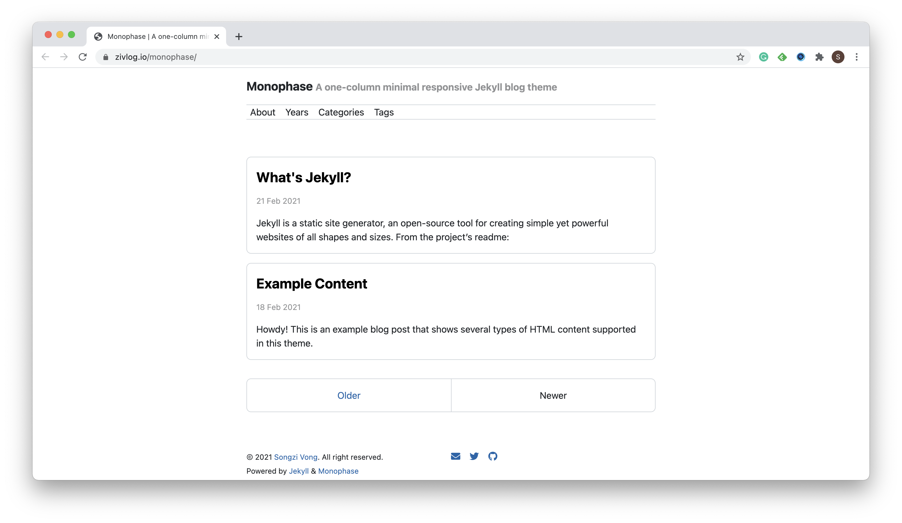
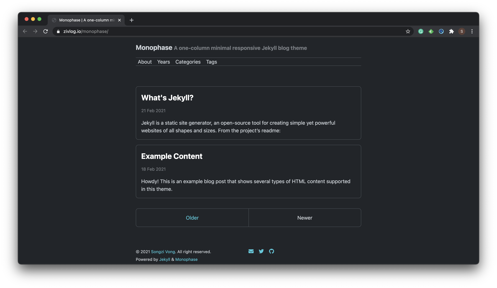

# Monophase <!-- omit in toc -->

Monophase is *a one-column minimal responsive Jekyll blog theme*.

One of the purposes of Monophase is to be an alternative option to the default theme of Jekyll—[Minima](https://github.com/jekyll/minima). Monophase is still keeping minimal, but meanwhile, more beautiful and mellow, and doesn't lose some useful basic features, such as archive.

Check the *[live demo](https://zivlog.io/monophase/)*.




## Highlight Features <!-- omit in toc -->

- [Normalize.css](https://github.com/necolas/normalize.css)
- [Open Color](https://github.com/yeun/open-color)
- [Font Awesome](https://fontawesome.com/)
- [Disqus](https://disqus.com/)
- [MathJax](https://www.mathjax.org/)
- [Google Analytics 4](https://support.google.com/analytics/answer/10089681?hl=en)
- [Jekyll Feed](https://github.com/jekyll/jekyll-feed/)
- [Jekyll Paginate](https://github.com/jekyll/jekyll-paginate)
- [Jekyll SEO Tag](https://github.com/jekyll/jekyll-seo-tag/)
- Related posts (time-based, because Jekyll) below each post
- Dark mode, via [`prefers-color-scheme`](https://developer.mozilla.org/en-US/docs/Web/CSS/@media/prefers-color-scheme)
- Archive implemented by pure [Liquid](https://shopify.github.io/liquid/)

## Table of Contents <!-- omit in toc -->

- [Installation](#installation)
- [Usage](#usage)
  - [Global Configuration](#global-configuration)
  - [Post Configuration](#post-configuration)
  - [Homepage](#homepage)
  - [Custom Head](#custom-head)
  - [Navigation](#navigation)
  - [Social Links](#social-links)
  - [Alert Messages](#alert-messages)
  - [Alignment](#alignment)
  - [Google Analytics 4](#google-analytics-4)
  - [Archive](#archive)
- [Contributing](#contributing)
- [Development](#development)
- [License](#license)

## Installation

Add this line to your Jekyll site's `Gemfile`:

```ruby
gem "monophase"
```

And add this line to your Jekyll site's `_config.yml`:

```yaml
theme: monophase
```

And then execute:

```shell
bundle
```

Or install it yourself as:

```shell
gem install monophase
```

You can also install the latest code via [`jekyll-remote-theme`](https://github.com/benbalter/jekyll-remote-theme):

1. Add this line to your Jekyll site's `Gemfile`:

    ```ruby
    gem "jekyll-remote-theme"
    ```

2. Add these lines to your Jekyll site's `_config.yml`:

    ```ruby
    plugins:
      - jekyll-remote-theme

    remote_theme: zivhub/monophase@main
    ```

## Usage

### Global Configuration

| Variable | Type | Default | Specification |
| -------- | ---- | ------- | ------------- |
| `title` | String | --- | The title of the website |
| `tagline` | String | --- | The tagline of the website |
| `lang` | String | `en` | The language of pages; The value can be overwritten by the `lang` variable on each page |
| `author.name` | String | --- | The name of the website author |
| `author.url` | String | --- | A URL of the website author |
| `tags_path` | String | --- | A path to the archive-by-tags page; It is used by tags on each post |
| `categories_path` | String | --- | A path to the archive-by-categories page; It is used by categories on each post |
| `disqus` | String | --- | Disqus short name |
| `google_analytics` | String | --- | Google Analytics 4 Measurement ID |

### Post Configuration

| Variable | Type | Default | Specification |
| -------- | ---- | ------- | ------------- |
| `description` | String | --- | A description of the current post |
| `last_modified_at` | String | --- | The date of the last modification you made on a post after its publishing |
| `author` | String or Array | --- | The author name(s) of the post |
| `comments` | Boolean | `true` | Does enable the Disqus comment system |
| `math` | Boolean | `false` | Does enable MathJax on this page |

### Homepage

You can create a homepage for your blog by setting `layout: home` in your `index.html`.

### Custom Head

Monophase leaves a placeholder to allow defining custom head. All you need to do is putting data into `_includes/custom-head.html`, and they would be automatically included in `<head>`.

### Navigation

The navigation bar of Monophase is configurable. You just need to specify titles and URLs in the file `_data/navigation.yml`, for example,

```yml
- title: About
  url: /about/
- title: Archive
  url: /archive/
- title: Categories
  url: /categories/
```

### Social Links

Monophase allows you to show social links on the website. All you need to do is creating a file `_data/social.yml`, for example,

```yml
- title: Email
  url: mailto:zivmsg@gmail.com
  icon: fas fa-envelope
- title: Twitter
  url: https://twitter.com/zivtwt
  icon: fab fa-twitter
- title: GitHub
  url: https://github.com/zivhub
  icon: fab fa-github
```

### Alert Messages

Monophase provides some predefined classes to specify different levels of **alert messages**. In order of tone from light to heavy, they are: `message-info`, `message-warning`, and `message-danger`. You may add it to single elements like a `<p>`, or to a parent if there are multiple elements to show.

### Alignment

Monophase also provides some predefined classes to specify the alignment of HTML elements—e.g. images. They are `align-center`, `align-left`, and `align-right`.

### Google Analytics 4

To enable [Google Analytics 4](https://support.google.com/analytics/answer/10089681?hl=en), you just need to set the [Measurement ID](https://support.google.com/analytics/answer/7372977?hl=en) in your `_config.yml`, for example,

```yml
google_analytics: G-XXXXXXX
```

### Archive

Monophase provides some built-in archive pages. It is implemented in pure Liquid. If you want to archive posts by years, you can create a page and put these code in it:

```yml
---
layout: archive
type: years
---
```

Similarly, if you want to archive posts by categories or tags, you can set the `type` property as `categories` or `tags`.

## Contributing

Bug reports and pull requests are welcome on GitHub at [https://github.com/zivhub/monophase](https://github.com/zivhub/monophase). This project is intended to be a safe, welcoming space for collaboration, and contributors are expected to adhere to the [Contributor Covenant](http://contributor-covenant.org) code of conduct.

## Development

To set up your environment to develop this theme, run `bundle install`.

Your theme is setup just like a normal Jekyll site! To test your theme, run `bundle exec jekyll serve` and open your browser at `http://localhost:4000`. This starts a Jekyll server using your theme. Add pages, documents, data, etc. like normal to test your theme's contents. As you make modifications to your theme and to your content, your site will regenerate and you should see the changes in the browser after a refresh, just like normal.

When your theme is released, only the files in `_layouts`, `_includes`, `_sass` and `assets` tracked with Git will be bundled.
To add a custom directory to your theme-gem, please edit the regexp in `monophase.gemspec` accordingly.

## License

The theme is available as open source under the terms of the [MIT License](https://opensource.org/licenses/MIT).
